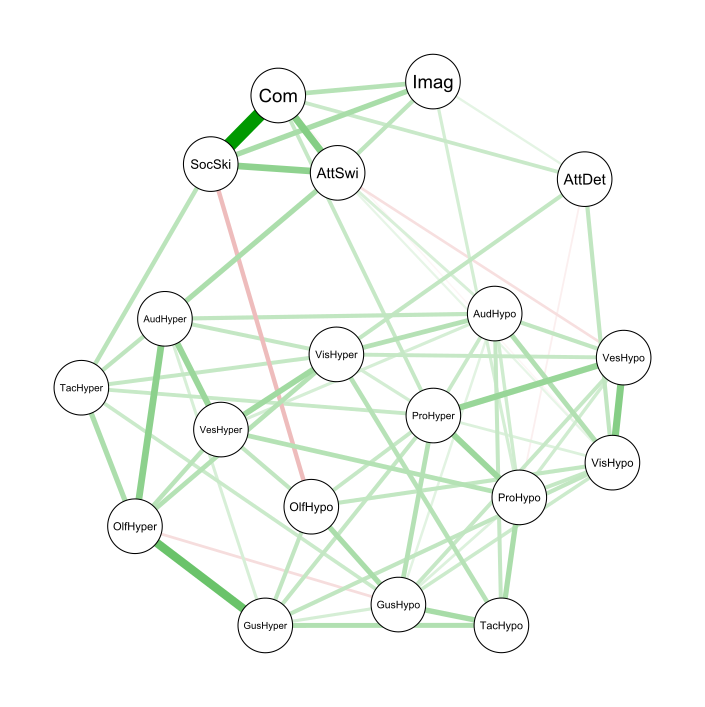

The starting point for this project was trying to understand how autism presents itself throughout the population. Is it a spectrum with everyone on it, or are autistic people their unique group? As a result of the COVID-19 outbreak, all participant recruitment was suspended. As such, I reached out to all researchers who had ever used the Glasgow Sensory Questionnaire. These researchers gave me access to data from tens of thousands of participants from countries all of the world.

Handling this amount of data from diverse sources came with challenges, however, I performed our intended analyses. A paper is currently being written and should be published as a pre-print shortly. A preview of our expected results can be seen below.

 
