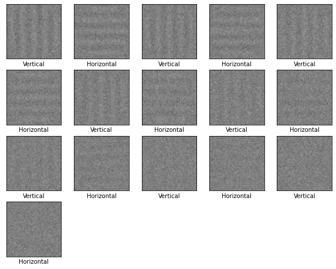

I have used the [Tensor Flow](https://www.tensorflow.org/) library developed by Google to train several artificial neural networks in categorisation tasks. The most developed of these is a network trained to distinguish whether noisy gabor patches were vertical or horizontal, pictured below. This is a replication of a paper by Bertone, Mottron, Jelenic, & Faubert (2005) which found that autistic people were better than typically developing people at some versions of their task.

I then injected internal noise into the model when testing on a test set of data. By comparing the effects of different levels of internal and external noise, I demonstrated a proof-of-concept that different levels of noise will have effects on performance that are not necessarily intuitive.

My most recent project using neural networks involves using the Tensor Flow framework to make inferences about drawing styles using the [Quick, Draw!](https://github.com/googlecreativelab/quickdraw-dataset) dataset.

*References*

Bertone, A., Mottron, L., Jelenic, P., & Faubert, J. (2005). Enhanced and diminished visuo-spatial information processing in autism depends on stimulus complexity. _Brain, 128_(10), 2430–2441. https://doi.org/10.1093/brain/awh561